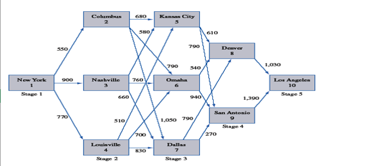
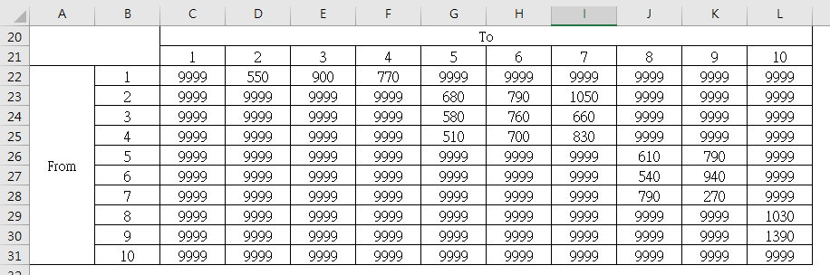
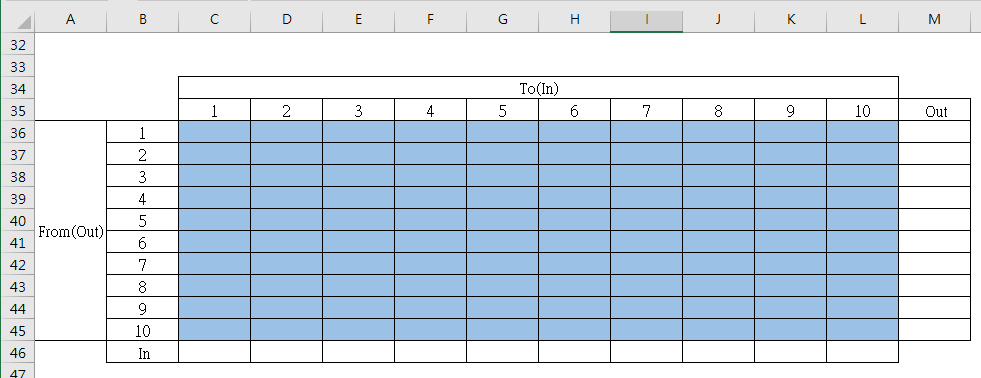
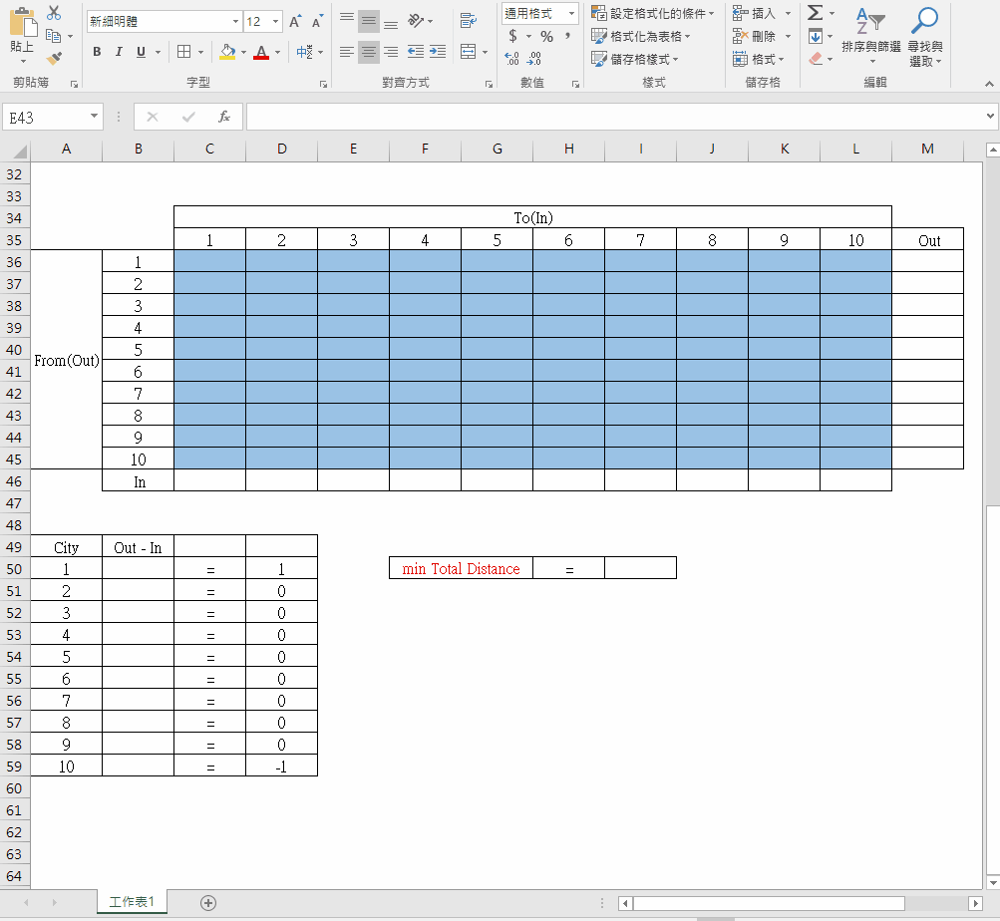
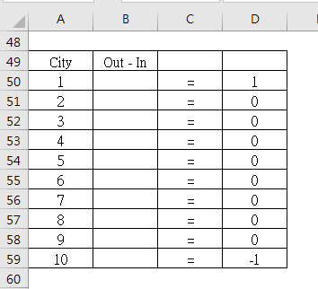
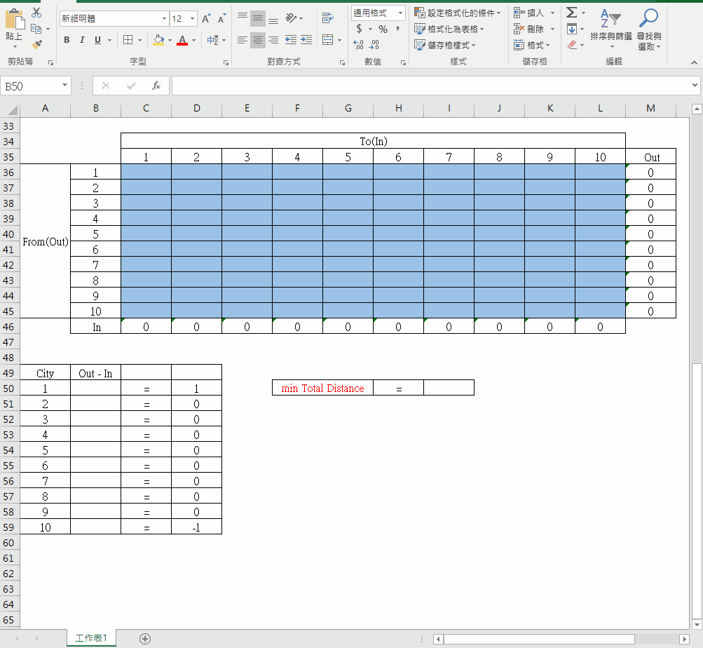
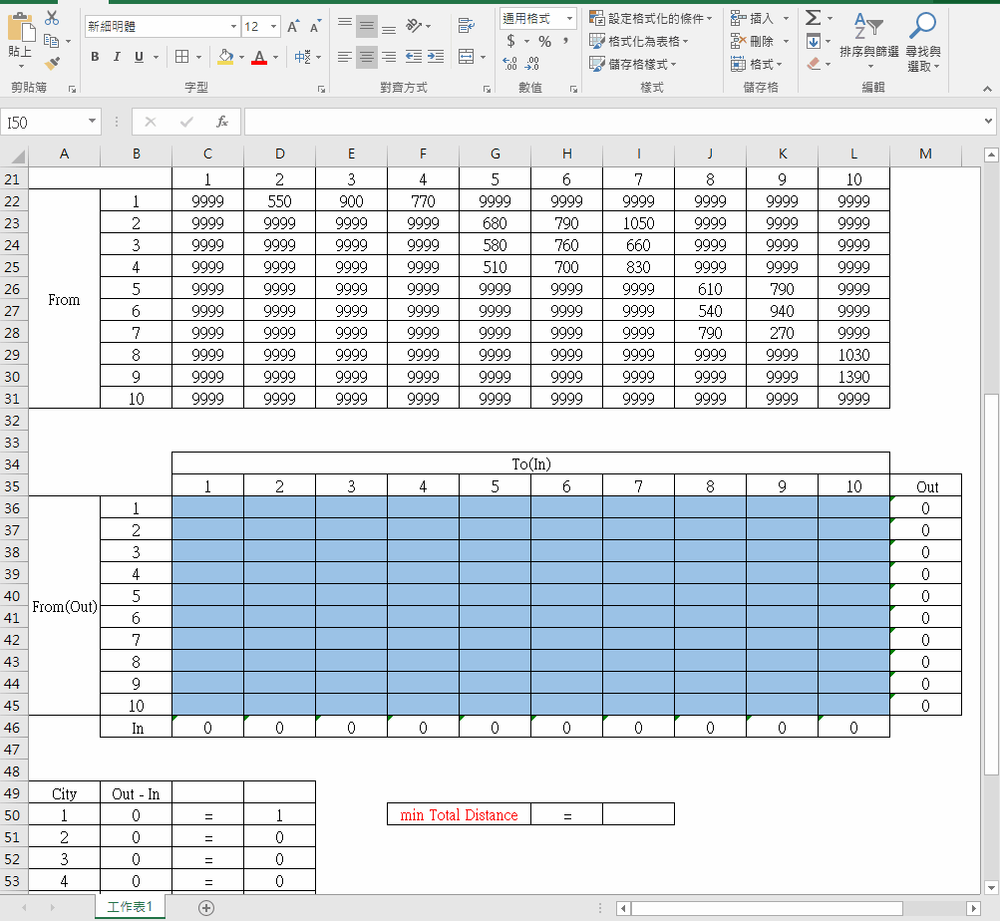
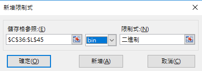
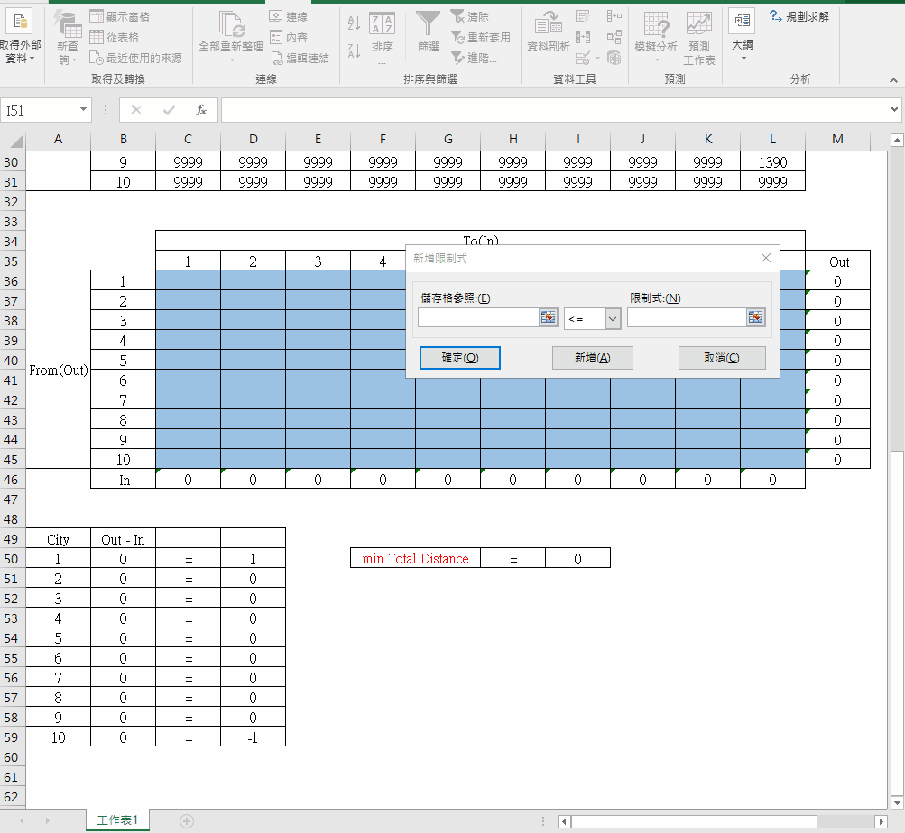
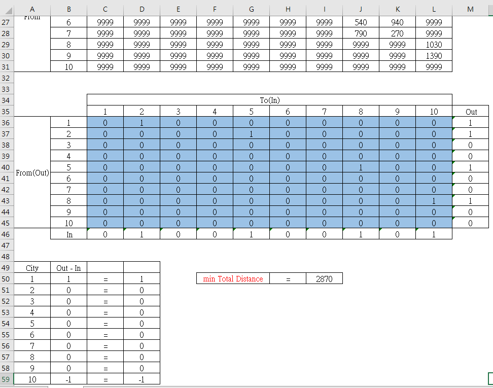

# A Network Problem

以下是從城市1(紐約)到城市10(洛杉磯)所有路徑的長度，假設不能走回頭路，求最短路徑。 

 我們可以將上圖中所有未標示的路徑與回頭路徑設為一個極大值(此處我設9999)，使excel solver計算最小值時，把這些不能走的路徑排除。
將上圖化成以下表格，每一個儲存格都代表一個路徑的路徑長。
 圖中D22儲存格的值為550，代表從(from)城市1到(to)城市2的路徑長為550。 

    
## 規劃求解
 第一步：建立規劃求解模型，根據需求製作表格。
 將以下藍色範圍儲存格設定為**決策變數**的路徑存放位置，裡面的值都是binary，1表示走過，0表示沒走過。 

  我們又另外加上In與Out欄位來記錄每個城市出城和進城的次數，公式如下gif: 

  由於我們求的是城市1到城市10的路徑長，所以:
1. 城市1的出城次數-進城次數(Out - In)必為1
2. 城市10的出城次數-進城次數(Out - In)必為1
3. 其它城市的出城次數-進城次數(Out - In)必為0

因此我們產生下圖的**約束條件**的等式 

 輸入約束條件的公式，如下gif: 

 設定I50為目標函數公式的存放位置，公式為路徑的路徑長圖表與決策變數圖表的乘積和，輸入公式如下gif: 

   
 第二步:規劃求解。
 創建好規劃求解模型後，點選「規劃求解」開始正式求解，步驟如下：
1. 在「規劃求解參數」對話框中單擊「設定目標式」(**目標函數**)單元格，用按鈕選擇單元格I50，並選擇「最小值」。 在「藉由變更變數儲存格」(**決策變數**)選擇藍色範圍儲存格。 

2. 新增限制式(**約束條件**)，點選上圖的「新增」，將所有決策變數(藍色範圍儲存格)設定為binary。 

3. 新增限制式(**約束條件**):出城次數-進城次數(Out - In)，如下gif: 

4. 將「求解方法」選單中選擇「單純LP」 

5. 目標函數、決策變數、約束條件都設定好後，點選「求解」。 

