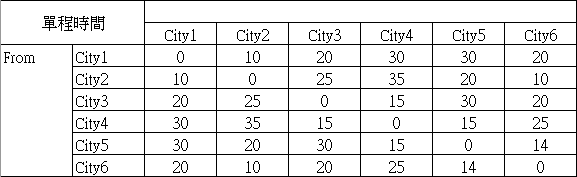
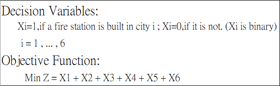
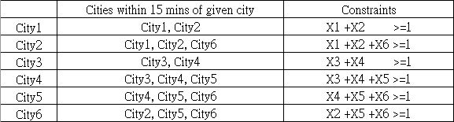
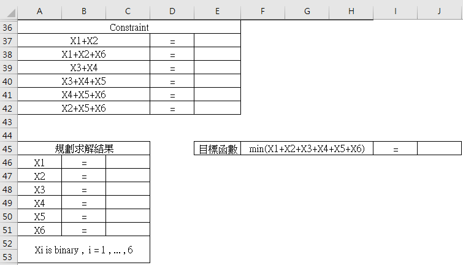
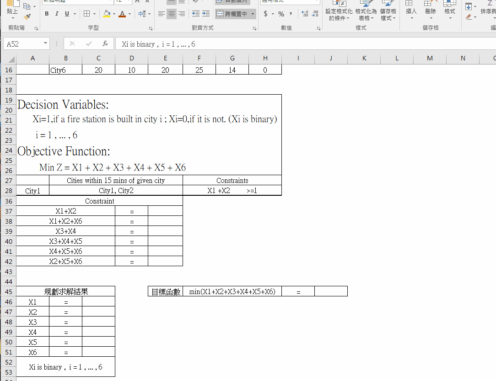
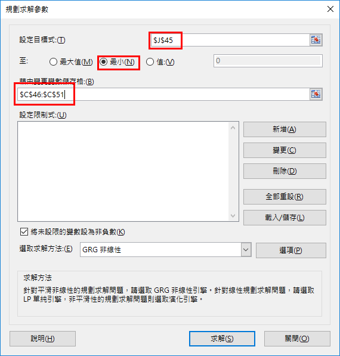
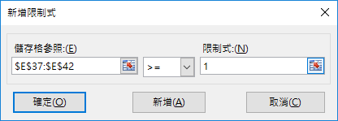
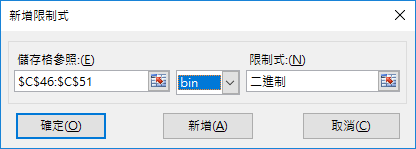
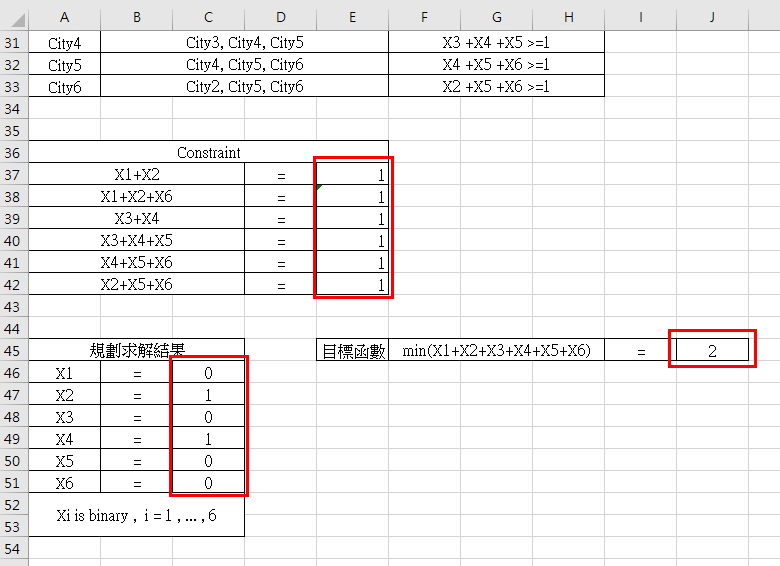

# 集合覆蓋模型 (Set Covering Model)

某縣有六個重要鄉鎮，該縣政府計畫興建消防隊，因此希望決定建立最少的消防隊數以確保每個城市至少有一對消防隊伍能在15分鐘的車程內。
 各鄉鎮間與其他鄉鎮的車程時間以下表所示，試建立IP最佳化模式使得消防隊數為最小。 

    

## 定義決策變數、目標函數、約束條件
 定義**決策變數**為X1 ~ X6，分別表示城市16是否要建立消防隊。
 X1 ~ X6為二元變項(binary)，1表示建立，0表示不建立。
 定義**目標函數**為X1+X2+X3+X4+X5+X6，由於題目要求，所以求最小值(min)。 

 
由上表我們可以分別觀察出:
 由城市1出發，能在15分鐘內到達城市2，因此我們可以合理推斷:城市1與城市2至少會有一個消防隊。
 所以我們得到一個**約束條件**不等式:X1+X2>=1。
 以此類推，得到以下約束條件不等式:

  
## 規劃求解
第一步：建立規劃求解模型，根據需求製作表格。
將C47~C51儲存格設定為決策變數X1 ~ X6的存放位置，J45設定為目標函數公式X1+X2+X3+X4+X5+X6的存放位置，E37 ~ E42為約束條件公式的存放位置。
如下圖: 

 在目標函數儲存格、約束條件儲存格分別輸入對應的公式，如下gif: 

    
第二步:規劃求解。
 創建好規劃求解模型後，點選「規劃求解」開始正式求解，步驟如下：

1. 在「規劃求解參數」對話框中單擊「設定目標式」(目標函數)單元格，用按鈕選擇單元格J45，並選擇「最小值」。 在「藉由變更變數儲存格」(決策變數)選擇C46 ~ C51。 

2. 新增限制式(約束條件)，點選上圖的「新增」，將C46 ~ C51設定為binary，將E37 ~ E42儲存的約束條件公式設定為>=1。 

3.點選「求解」在「規劃求解結果」對話框單擊「確定」，即可計算出最佳解。 

