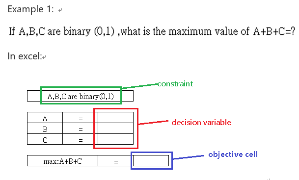
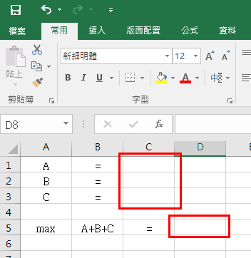
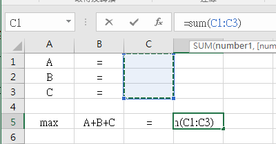
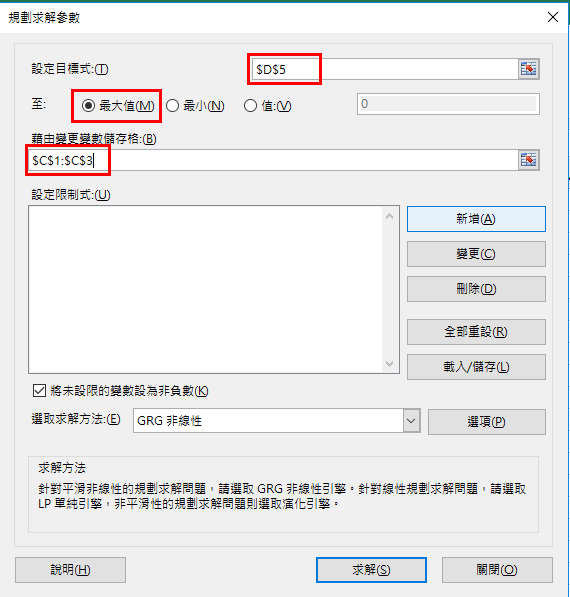
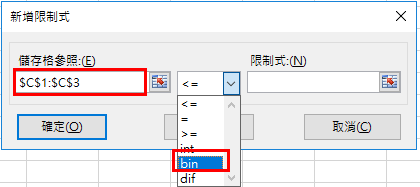
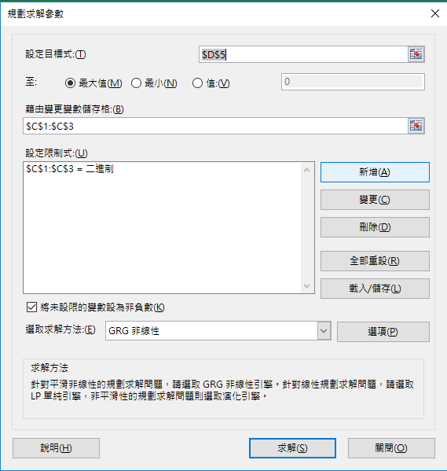
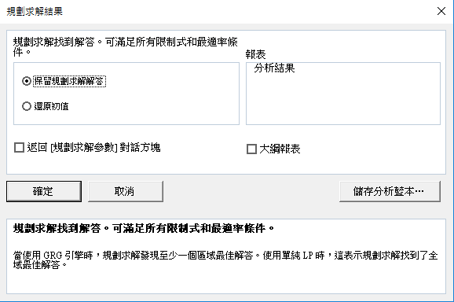
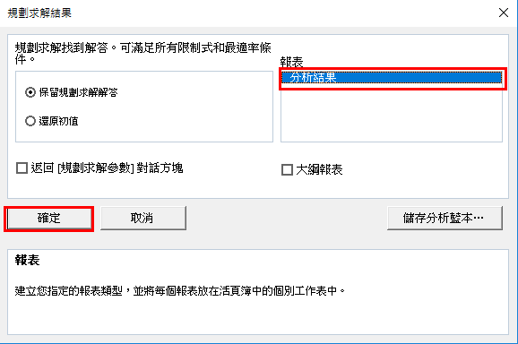
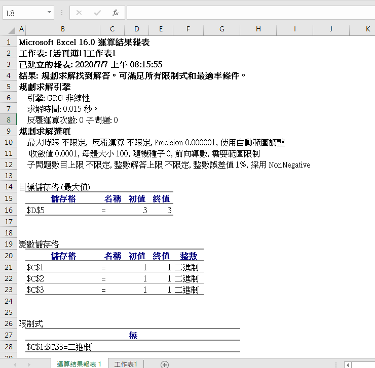

# 規劃求解簡介

「規劃求解」是可用於模擬分析(假設分析)的 Microsoft Excel 增益集程式。
  「規劃求解」可以用來尋找儲存格 (又稱為**目標函數、目標儲存格**) 中**公式**的最佳 (最大或最小) 值，但必須遵守工作表上其他公式儲存格之值的**限制式**。 [規劃求解] 運用一組儲存格 (稱為**決策變數**)，來計算目標儲存格與限制式儲存格中的公式。
  「規劃求解」會調整決策變數儲存格中的值，以符合限制式儲存格的限制並產生您期望的目標函數儲存格結果。

  在Excel中，一個規劃求解問題由以下3個部分組成：決策變數、目標函數、約束條件。

1. 決策變數(decision variable)：是實際問題中有待於解決的未知因素，一個規劃問題中可能有多個變量。一組決策變量代表一個規劃求解方案。

2. 目標儲存格(objective cell)：表示規劃求解要達到的最終目標。一般來說，目標變數是規劃模型中可變量的函數。可以是線性函數，也可以是非線性函數。

3. 限制式(constraint)：是實現目標的限制條件，與規劃求解的結果有著密切的關係，對決策變數中的值起著直接的限制作用，可以是等式，也可以是不等式。

  以下是一個決策變數、目標函數、約束條件的簡單範例: 

    
## 載入規劃求解增益集
 載入步驟 :
1. 開啟Excel，點選左上方[檔案]索引標籤 > [ 選項]。
2. 按一下 [增益集]，然後在 [管理] 方塊中選取 [ Excel 增益集]。
3. 按一下 [執行]。
4. 選取 [現有的增益集] 方塊中的 [規劃求解增益集] 核取方塊，然後按一下[確定]。
5. 載入規劃求解增益集之後，[資料] 索引標籤上出現[規劃求解]。
 可參考以下gif檔:
 
 參考網址:[在 Excel 中載入規劃求解增益集](https://support.microsoft.com/zh-tw/office/%E5%9C%A8-excel-%E4%B8%AD%E8%BC%89%E5%85%A5%E8%A6%8F%E5%8A%83%E6%B1%82%E8%A7%A3%E5%A2%9E%E7%9B%8A%E9%9B%86-612926fc-d53b-46b4-872c-e24772f078ca) 

    
## 操作範例
透過上面提到的範例了解規劃求解功能: 

 第一步：建立規劃求解模型，根據需求製作表格。
 將C1、C2、C3儲存格設定為決策變數A、B、C的存放位置，D5設定為目標函數公式A+B+C的存放位置
 如下圖: 

 
 在D5輸入目標函數A+B+C: 

 第二步:規劃求解。
 創建好規劃求解模型後，點選「規劃求解」開始正式求解，步驟如下：
1. 在「規劃求解參數」對話框中單擊「設定目標式」(**目標函數**)單元格，用按鈕選擇單元格D5，並選擇「最大值」。 在「藉由變更變數儲存格」(**決策變數**)選擇C1、C2、C3。 

2. 新增限制式(**約束條件**)，點選上圖的「新增」，將C1、C2、C3設定為binary。 

3. 目標函數、決策變數、約束條件都設定好後，點選「求解」。 

4. 在「規劃求解結果」對話框單擊「確定」，即可計算出最佳解。 

 第三步:生成規劃求解的結果報告。
 規劃求解不但可以在原本工作表中保存求解結果，還可以將求解的結果製作為報告。
 在「規劃求解結果」對話框中，點擊「分析結果」，然後再點擊「確定」。 

 
 系統會自動在當前工作薄中插入一個「運算結果報告1」工作表，在該工作表中顯示運算結果報告。
 在該報告中可以看到目標單元格的最佳解，決策變數單元格的取值以及約束條件情況。 

